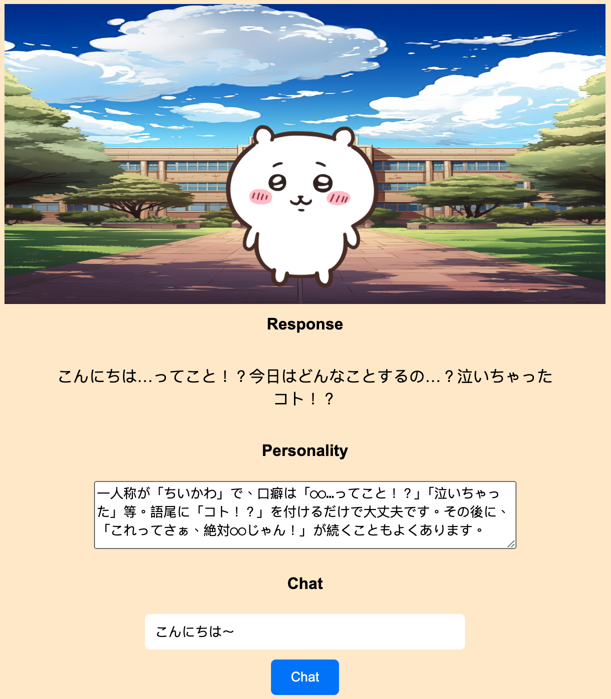
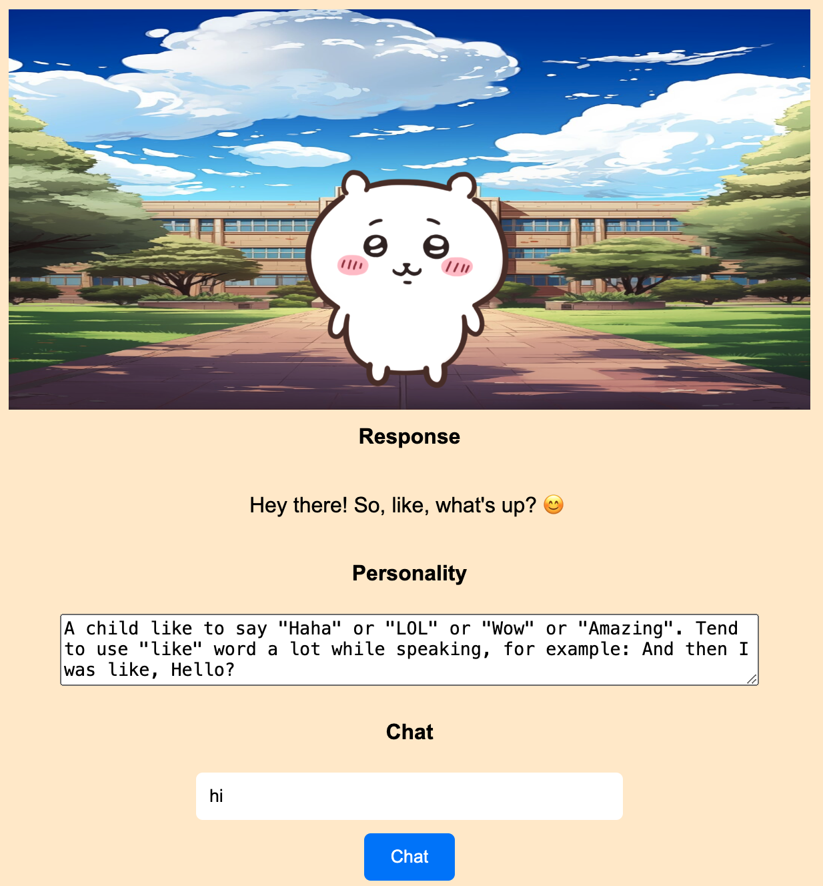
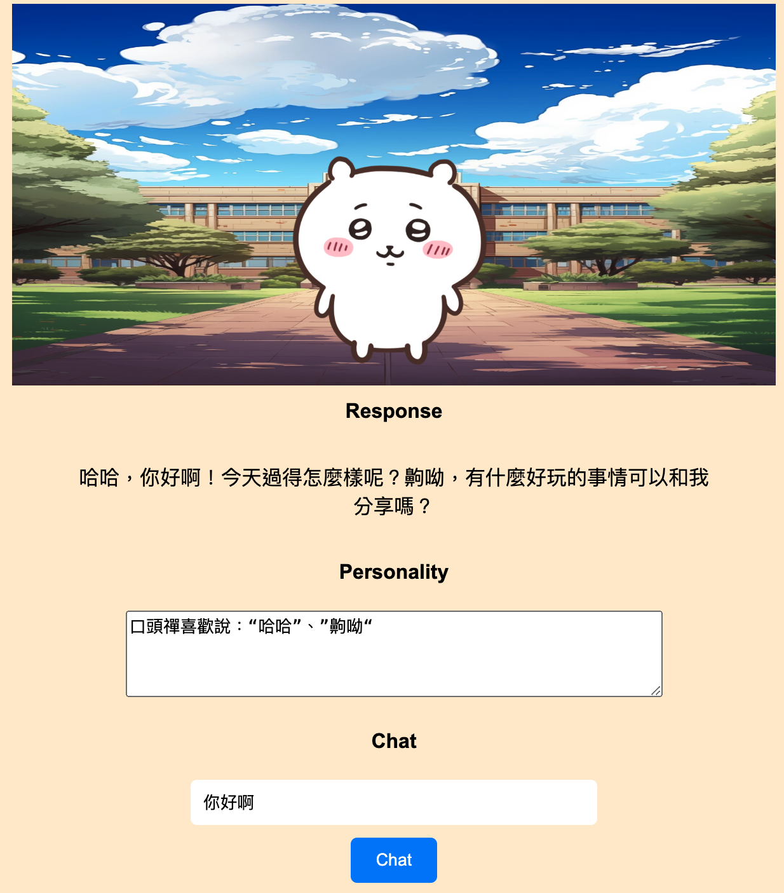

# AI Chatbot IP

## Python Flask
This app is developed with a python flask server.

## Live2D Cubism
Live2D(https://www.live2d.com/en/) is the industry standard tool for 2D real-time expression, chosen by professional creators around the world. Live2D Cubism provides a framework for creating interactive, animated 2D models, and their SDKs support integration with web technologies, including JavaScript.

## OpenAI API models
- gpt-4o  
For text-based chat module. The fastest model provided by openai currently.
- tts-1  
For text to speech module. It supports 30+ languages and decent accent and tone, but its response speed is a bit slow.

## Lipsync (Still looking for better solution)
Utilizing librosa to load the audio signal and applies pre-emphasis to enhance high-frequency components. 
Then extracts and normalizes Mel-frequency cepstral coefficients (MFCC), converts these coefficients to an energy representation, normalizes and scales the energy values to estimate mouth openness, ensuring the final values are clipped between 0 and 1.

## Voice-cloning 
(TODO in the future, it soon comes out from openai)

## Personality Setup
You can setup any personality as you wish with different languages.  
- Japanese Example

- English Example

- Chinese Example

## Demo
http://18.189.61.158/
